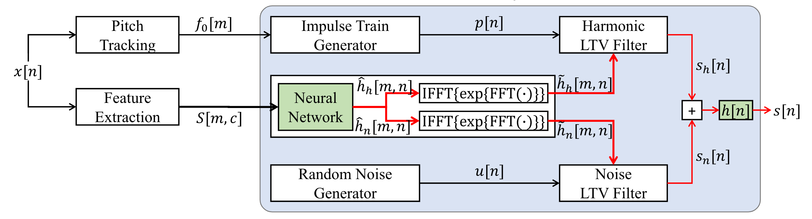

# Neural-Homomorphic-Vocoder
Unofficial PyTorch implementation of [Neural Homomorphic Vocoder](https://www.isca-archive.org/interspeech_2020/liu20_interspeech.html) by Zhijun Liu, Kuan Chen, Kai Yu.

This paper propose the neural homomorphic vocoder (NHV), a source-filter model based neural vocoder framework.

**Abstract :**
NHV synthesizes speech by filtering impulse trains and noise with linear time-varying (LTV) filters. A neural network controls the LTV filters by estimating complex cepstrums of time-varying impulse responses given acoustic features. The proposed framework can be trained with a combination of multi-resolution STFT loss and adversarial loss functions. Due to the use of DSP-based synthesis methods, NHV is highly efficient, fully controllable and interpretable. A vocoder was built under the framework to synthesize speech given log-Mel spectrograms and fundamental frequencies. While the model cost only 15 kFLOPs per sample, the synthesis quality remained comparable to baseline neural vocoders in both copy-synthesis and text-to-speech.

Audio samples and further information are provided in the [online supplement](https://zjlww.github.io/nhv-web/).

<center></center>

## Installation
Clone the repository and install dependencies.
```shell
# the codebase has been tested on Python 3.7 with PyTorch 1.8.0 binaries
git clone https://github.com/LqNoob/Neural-Homomorphic-Vocoder
pip install -r requirements.txt
```

## Training
```
python train.py --config config_v1.json
```

## Inference from wav file or for end-to-end speech synthesis
1. Make `test_files` or `test_mel_files` directory and copy wav files or generated mel-spectrogram files into the directory.
2. Run the following command.
    ```
    python inference.py --checkpoint_file [generator checkpoint file path]
    python inference_e2e.py --checkpoint_file [generator checkpoint file path]
    ```
Generated wav files are saved in `generated_files` or `generated_files_from_mel` by default.<br>
You can change the path by adding `--output_dir` option.

## Acknowledgements
We referred to [hifi-gan](https://github.com/jik876/hifi-gan), [dsp](https://github.com/zjlww/dsp) and [training_details](https://zjlww.github.io/nhv-web/training_details.html) to implement this.
